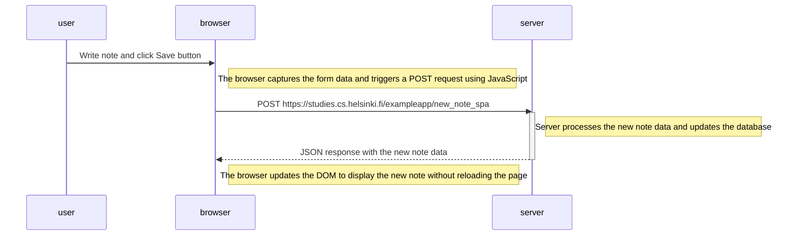

```mermaid

sequenceDiagram
    participant user
    participant browser
    participant server

    user->>browser: Write note and click Save button
    Note right of browser: The browser captures the form data and triggers a POST request using JavaScript

    browser->>server: POST https://studies.cs.helsinki.fi/exampleapp/new_note_spa
    activate server
    Note right of server: Server processes the new note data and updates the database
    server-->>browser: JSON response with the new note data
    deactivate server

    Note right of browser: The browser updates the DOM to display the new note without reloading the page

```